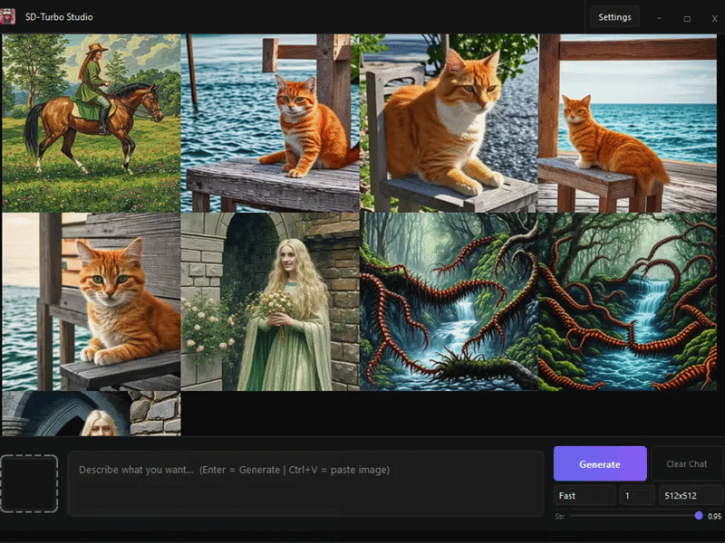
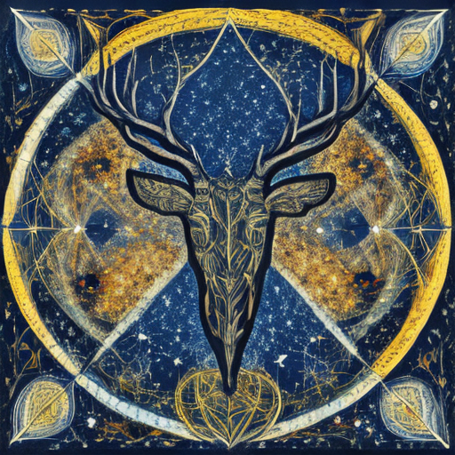
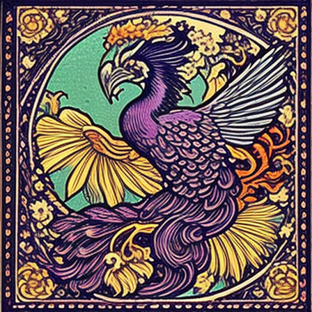
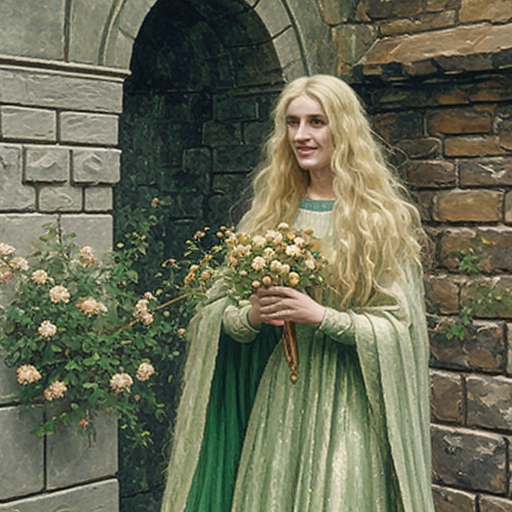
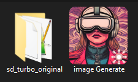
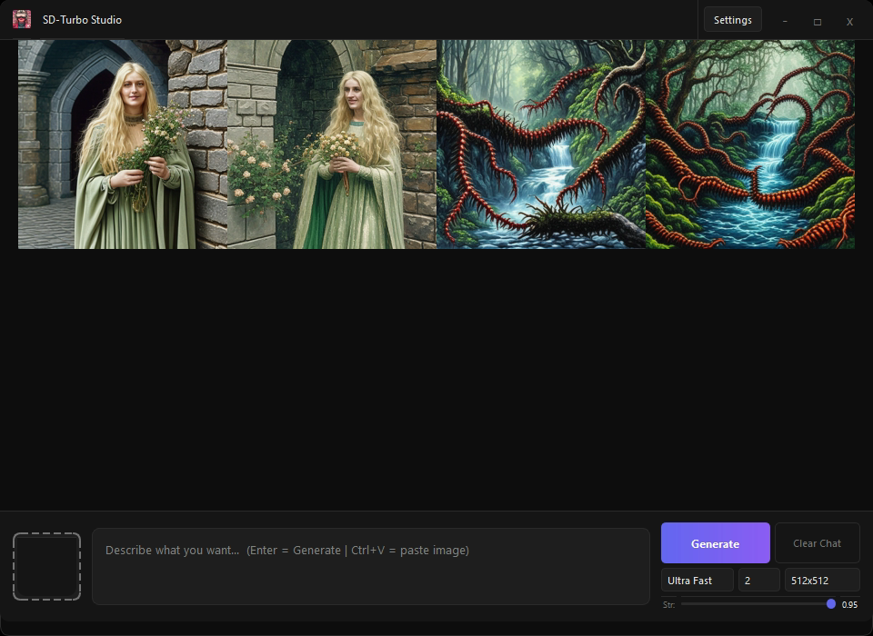

<p align="center">
  
  <h1 align="center">SD Turbo Generator</h1>
</p>
<p align="center">

<a href="#النسخة-العربية">النسخة العربية</a>
</p>


> This project is a simple, professional user interface designed for generating images using the SD Turbo model.





## Features

*   **Local Operation:** The application runs entirely offline, requiring no internet connection for operation.
*   **Model Integration:** It integrates with the SD Turbo model by loading the necessary weights from the `sd_turbo_original` directory.
*   **Workflow:** Place the `image_generate` program near the `sd_turbo_original` folder to make the application function correctly.
*   **Generation Limits:** Capable of generating up to 10 images sequentially.
*   **Resolution Range:** Supports image sizes ranging from 256 to 1024 pixels.
*   **Quality Presets:** Offers various quality modes: `turbo`, `fast`, `medium`, `quality`, and `max`.
    *   **Image-to-Image:** Includes an Image-to-Image feature for advanced image manipulation.


| Image | Image |
|---|---|
|  |  |


| Image | Image |
|---|---|
|  |  |


## Setup

1.  **Download Model:** Download the SD Turbo weights from the official Hugging Face repository: https://huggingface.co/stabilityai/sd-turbo
2.  **Setup Directory:** Place the downloaded `sd_turbo_original` folder in the project directory.
3.  **Run Application:** Place the `image generate` program next to the `sd_turbo_original` folder to run the application.

> [image Generate](https://github.com/YASSER-27/sd-turbo-original/releases)

### ROOT 




```

ROOT:
├── image Generate.exe
└── sd_turbo_original
    ├── ggml.txt
    ├── model_index.json
    ├── scheduler
    │   └── scheduler_config.json
    ├── sd_turbo.safetensors
    ├── text_encoder
    │   ├── config.json
    │   ├── model.fp16.safetensors
    │   └── model.safetensors
    ├── tokenizer
    │   ├── merges.txt
    │   ├── special_tokens_map.json
    │   ├── tokenizer_config.json
    │   └── vocab.json
    ├── unet
    │   ├── config.json
    │   ├── diffusion_pytorch_model.fp16.safetensors
    │   └── diffusion_pytorch_model.safetensors
    └── vae
        ├── config.json
        ├── diffusion_pytorch_model.fp16.safetensors
        └── diffusion_pytorch_model.safetensors

```
[](https://opensource.org/licenses/MIT)


> YASSER-27


<h2 id="النسخة-العربية">النسخة العربية</h2>

## نظرة عامة

هذا المشروع هو واجهة بسيطة واحترافية مصممة لتوليد الصور باستخدام نموذج SD Turbo.

## الميزات

*   **العمل دون اتصال:** يعمل التطبيق بالكامل دون اتصال بالإنترنت، ولا يتطلب اتصالاً بالإنترنت للعمل.
*   **تكامل النموذج:** يتكامل مع نموذج SD Turbo عن طريق تحميل الأوزان اللازمة من مجلد `sd_turbo_original`.
*   **سير العمل:** ضع برنامج `image_generate` بالقرب من مجلد `sd_turbo_original` ليعمل التطبيق بشكل صحيح.
*   **حدود التوليد:** قادر على توليد ما يصل إلى 10 صور بالتتابع.
*   **نطاق الدقة:** يدعم أحجام صور تتراوح من 256 إلى 1024 بكسل.
*   **إعدادات الجودة:** يوفر أوضاع جودة مختلفة: `turbo`, `fast`, `medium`, `quality`, و `max`.
    *   **صورة إلى صورة:** يتضمن ميزة صورة إلى صورة لمعالجة الصور المتقدمة.

## الإعداد

1.  **تحميل النموذج:** قم بتحميل أوزان SD Turbo من مستودع Hugging Face الرسمي: https://huggingface.co/stabilityai/sd-turbo
2.  **إعداد المجلد:** ضع مجلد `sd_turbo_original` في مجلد المشروع.
3.  **تشغيل التطبيق:** ضع برنامج `image_generate` بجوار مجلد `sd_turbo_original` لتشغيل التطبيق.

---


